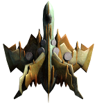

All Plugins (4)

[Cheats](https://github.com/zuckungtest/EndlessSky-PluginArchive/blob/main/res/mds/cheats.md) (2) | [Gameplay](https://github.com/zuckungtest/EndlessSky-PluginArchive/blob/main/res/mds/gameplay.md) (1) | [Graphics](https://github.com/zuckungtest/EndlessSky-PluginArchive/blob/main/res/mds/graphics.md) (0) | [Outfits](https://github.com/zuckungtest/EndlessSky-PluginArchive/blob/main/res/mds/outfits.md) (0) 
[Overhauls](https://github.com/zuckungtest/EndlessSky-PluginArchive/blob/main/res/mds/overhauls.md) (1) | [Overwrites](https://github.com/zuckungtest/EndlessSky-PluginArchive/blob/main/res/mds/overwrites.md) (0) | [Patches](https://github.com/zuckungtest/EndlessSky-PluginArchive/blob/main/res/mds/patches.md) (0) | [Races](https://github.com/zuckungtest/EndlessSky-PluginArchive/blob/main/res/mds/races.md) (0) 
[Ships](https://github.com/zuckungtest/EndlessSky-PluginArchive/blob/main/res/mds/ships.md) (0) | [Starts](https://github.com/zuckungtest/EndlessSky-PluginArchive/blob/main/res/md/starts.md) (0) | [Story](https://github.com/zuckungtest/EndlessSky-PluginArchive/blob/main/res/mds/story.md) (0) | [Weapons](https://github.com/zuckungtest/EndlessSky-PluginArchive/blob/main/res/mds/weapons.md) (0) 
[Uncategorized](https://github.com/zuckungtest/EndlessSky-PluginArchive/blob/main/res/mds/uncategorized.md) (0) 

---

## Cheats

2 plugins in this category.

 

---

### automata.destruction.0percent
</img> 

[automata.destruction.0percent.zip](https://github.com/zuckungtest/EndlessSky-PluginArchive/releases/download/Latest/automata.destruction.0percent.zip) | 44.09 kb | 2025-02-14 | [view files](https://github.com/zuckungtest/EndlessSky-PluginArchive/tree/main/Working/automata.destruction.0percent/)  
Author: zuckung | Category: Cheats  
[https://github.com/zuckung/endless-sky-plugins](https://github.com/zuckung/endless-sky-plugins) (last commit 2024-06-07)  

>Modifies the self destruction chance of Sestor and Mereti ships to a value of 0.0 (0%). See the readme for details.

:blue_book: Plugin readme

<blockquote>### automata.destruction.0percent
 
 
Modifies the self destruction chance of Sestor and Mereti ships to a value of 0.0 (0%). 
 
Sestor 349/109/78/71/53/27/14 and Mereti 512/256/128/64/32/16/8 ships have a self destruction value of 0.0 (0%) now. 
You can easily change the values in automata.txt for each ship ('"self destruct" .0') to a value of your choice. I.e. 0.12 is 23%, 0.3 is 51%, 0.5 is 75%. Its calculated twice, first the chance for self destruction on boarding(i.e. 0.3) is 30%, then of the remaining 70% again 30% chance for self destruction on capturing. That makes 30% + 21% = 51% overall chance for self destruction on a capturing try. 
 
 
Changelog: 
 
2024-06-07 
text corrections (thx to TheGiraffe3) 
 
2023-10-17 
added plugin.txt 
 
2023-09-07 
changed icon 
changed about.txt 
changed readme 

</blockquote>

Status: tested with 0.10.2  
Daily update check: </img> 

---

### quarg.farm
</img> 

[quarg.farm.zip](https://github.com/zuckungtest/EndlessSky-PluginArchive/releases/download/Latest/quarg.farm.zip) | 26.42 kb | 2025-02-15 | [view files](https://github.com/zuckungtest/EndlessSky-PluginArchive/tree/main/Working/quarg.farm/)  
Author: zuckung | Category: Cheats  
[https://github.com/zuckung/endless-sky-plugins](https://github.com/zuckung/endless-sky-plugins) (last commit 2025-01-27)  

>Adds a new system Saquerver (between human and coalition space) where you can farm a new Quarg faction. Also the death sentence from all other Quarg got removed. See the readme for details.
>

:blue_book: Plugin readme

<blockquote>### quarg.farm
 
 
Adds a new system "Saquerver" (between human and coalition space) where you can farm a new Quarg faction. Also the death sentence from all other Quarg got removed. 
 
The system "Saquerver" lies between "Serquergen" and "Ablub". The usual-sized Quarg fleets spawn there. Killing/plundering them doesn't make the other Quarg angry. Landing on the other Quarg faction's worlds doesn't end with a death sentence when you have their ships/outfits. 
 
 
Changelog: 
 
2025-01-27 
adjusted system "Saquerver" position to not collide with 0.10.11 additions 
 
2024-10-06 
removed death sentence from government "Quarg (Incipias)" 
 
2024-05-26 
initial release 

</blockquote>

Status: made for 0.10.6  
Daily update check: </img> 

[back to top](https://github.com/zuckungtest/EndlessSky-PluginArchive/blob/main/res/mds/cheats.md#cheats)

