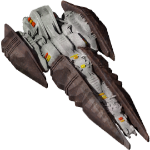

All Plugins (4)

[Cheats](https://github.com/zuckungtest/EndlessSky-PluginArchive/blob/main/res/mds/cheats.md) (2) | [Gameplay](https://github.com/zuckungtest/EndlessSky-PluginArchive/blob/main/res/mds/gameplay.md) (1) | [Graphics](https://github.com/zuckungtest/EndlessSky-PluginArchive/blob/main/res/mds/graphics.md) (0) | [Outfits](https://github.com/zuckungtest/EndlessSky-PluginArchive/blob/main/res/mds/outfits.md) (0) 
[Overhauls](https://github.com/zuckungtest/EndlessSky-PluginArchive/blob/main/res/mds/overhauls.md) (1) | [Overwrites](https://github.com/zuckungtest/EndlessSky-PluginArchive/blob/main/res/mds/overwrites.md) (0) | [Patches](https://github.com/zuckungtest/EndlessSky-PluginArchive/blob/main/res/mds/patches.md) (0) | [Races](https://github.com/zuckungtest/EndlessSky-PluginArchive/blob/main/res/mds/races.md) (0) 
[Ships](https://github.com/zuckungtest/EndlessSky-PluginArchive/blob/main/res/mds/ships.md) (0) | [Starts](https://github.com/zuckungtest/EndlessSky-PluginArchive/blob/main/res/md/starts.md) (0) | [Story](https://github.com/zuckungtest/EndlessSky-PluginArchive/blob/main/res/mds/story.md) (0) | [Weapons](https://github.com/zuckungtest/EndlessSky-PluginArchive/blob/main/res/mds/weapons.md) (0) 
[Uncategorized](https://github.com/zuckungtest/EndlessSky-PluginArchive/blob/main/res/mds/uncategorized.md) (0) 

---

## Gameplay

1 plugins in this category.

 

---

### automata.in.human.space
</img> 

[automata.in.human.space.zip](https://github.com/zuckungtest/EndlessSky-PluginArchive/releases/download/Latest/automata.in.human.space.zip) | 35.37 kb | 2025-02-15 | [view files](https://github.com/zuckungtest/EndlessSky-PluginArchive/tree/main/Working/automata.in.human.space/)  
Author: zuckung | Category: Gameplay  
[https://github.com/zuckung/endless-sky-plugins](https://github.com/zuckung/endless-sky-plugins) (last commit 2024-09-24)  

>Brings jump drive equipped automata into human space after the wanderer campaign. See the readme for details.

:blue_book: Plugin readme

<blockquote>### automata.in.human.space
 
 
Brings jump drive equipped automata into human space after the wanderer campaign.  
 
You can find them where Korath ships in human space are usually found(ember waste and eastern syndicate).  
The chance to encounter previous Korath ships or automata is like 50/50.  
 
 
Changelog: 
 
2024-09-24 
removed jumpdrive from fighters and drones and put them correctly into the carriers 
adjusted some fleet variants 
 
2023-10-17 
added plugin.txt 
 
2023-09-01 
added more fleet variants  
reworked readme  
changed icon.png 

</blockquote>

Status: tested with 0.10.2  
Daily update check: </img> 

[back to top](https://github.com/zuckungtest/EndlessSky-PluginArchive/blob/main/res/mds/gameplay.md#gameplay)

