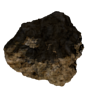

All Plugins (4)

[Cheats](https://github.com/zuckungtest/EndlessSky-PluginArchive/blob/main/res/mds/cheats.md) (2) | [Gameplay](https://github.com/zuckungtest/EndlessSky-PluginArchive/blob/main/res/mds/gameplay.md) (1) | [Graphics](https://github.com/zuckungtest/EndlessSky-PluginArchive/blob/main/res/mds/graphics.md) (0) | [Outfits](https://github.com/zuckungtest/EndlessSky-PluginArchive/blob/main/res/mds/outfits.md) (0) 
[Overhauls](https://github.com/zuckungtest/EndlessSky-PluginArchive/blob/main/res/mds/overhauls.md) (1) | [Overwrites](https://github.com/zuckungtest/EndlessSky-PluginArchive/blob/main/res/mds/overwrites.md) (0) | [Patches](https://github.com/zuckungtest/EndlessSky-PluginArchive/blob/main/res/mds/patches.md) (0) | [Races](https://github.com/zuckungtest/EndlessSky-PluginArchive/blob/main/res/mds/races.md) (0) 
[Ships](https://github.com/zuckungtest/EndlessSky-PluginArchive/blob/main/res/mds/ships.md) (0) | [Starts](https://github.com/zuckungtest/EndlessSky-PluginArchive/blob/main/res/md/starts.md) (0) | [Story](https://github.com/zuckungtest/EndlessSky-PluginArchive/blob/main/res/mds/story.md) (0) | [Weapons](https://github.com/zuckungtest/EndlessSky-PluginArchive/blob/main/res/mds/weapons.md) (0) 
[Uncategorized](https://github.com/zuckungtest/EndlessSky-PluginArchive/blob/main/res/mds/uncategorized.md) (0) 

---

## Overhauls

1 plugins in this category.

 

---

### too.many.asteroids
</img> 

[too.many.asteroids.zip](https://github.com/zuckungtest/EndlessSky-PluginArchive/releases/download/Latest/too.many.asteroids.zip) | 19.0 kb | 2025-02-15 | [view files](https://github.com/zuckungtest/EndlessSky-PluginArchive/tree/main/Working/too.many.asteroids/)  
Author: zuckung | Category: Overhauls  
[https://github.com/zuckung/endless-sky-plugins](https://github.com/zuckung/endless-sky-plugins) (last commit 2025-01-25)  

>Removes all non-mineable asteroids from all systems. Mineable asteroids and asteroid belts are untouched.
>Increases game performance. See the readme for details.

:blue_book: Plugin readme

<blockquote>### too.many.asteroids  
 
 
Removes all non-mineable asteroids from all systems. Mineable asteroids and asteroid belts are untouched.  
Increases game performance. 
 
 
Every of the 699 base game systems (0.10.11) is edited via a remove command for full compatibility with other system altering plugins. A total of 3149 asteroid entries got removed. 
 
 
Changelog: 
 
2025-01-25 
added the 0.10.11 systems 
 
2024-09-29 
added the 0.10.9 systems 
 
2024-06-07 
text corrections (thx to TheGiraffe3) 
updated to 0.10.7 
 
2024-02-04 
added the 0.10.5 systems 
 
2023-10-17 
added plugin.txt 
 
2023-09-01 
added new icon.png 
reworked readme 
removed py script 
 
2023-06-17 
updated to 0.10.1 
added a python script which generates the asteroids.txt(in case I don't update this mod, everyone can do it in no time.) 

</blockquote>

Status: tested with 0.10.2  
Daily update check: </img> 

[back to top](https://github.com/zuckungtest/EndlessSky-PluginArchive/blob/main/res/mds/overhauls.md#overhauls)

